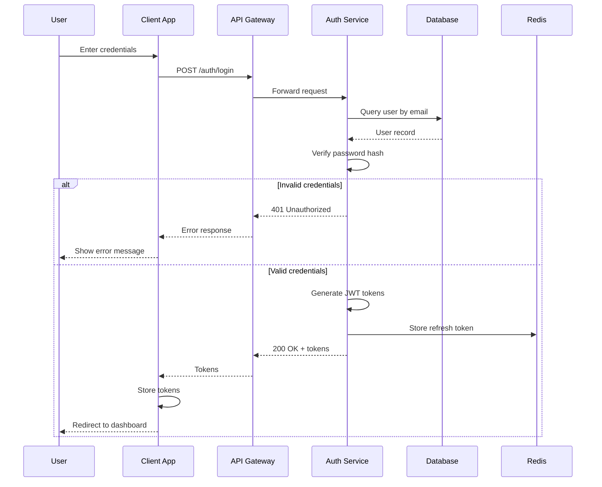
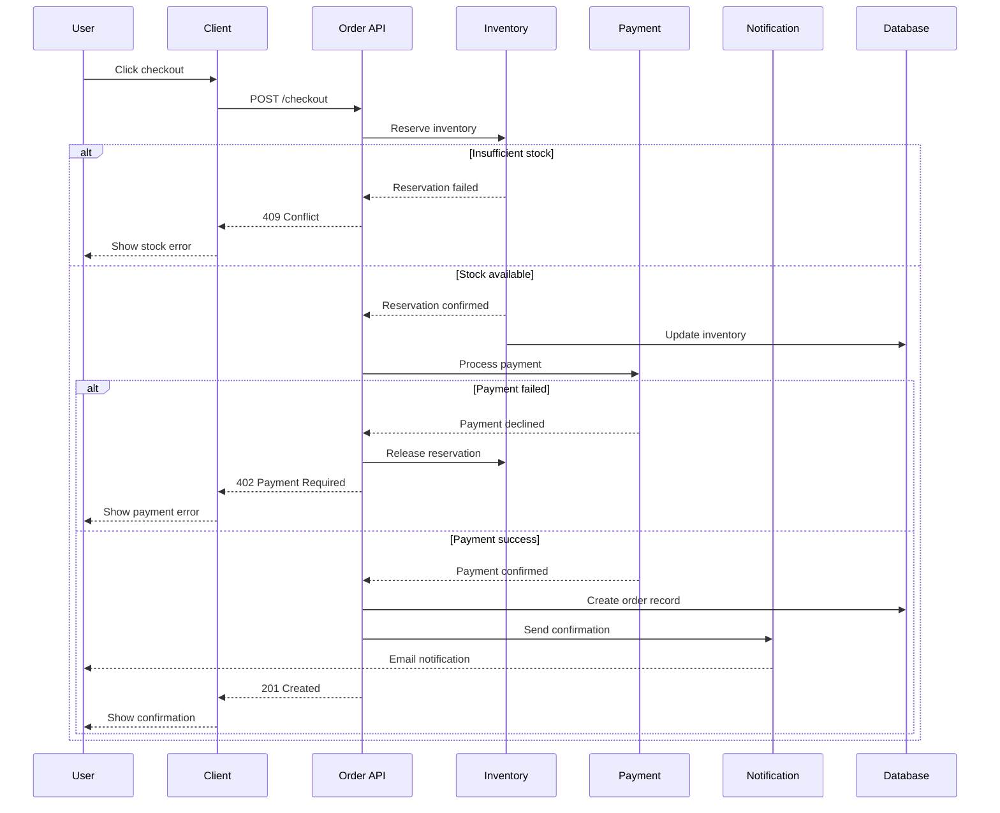
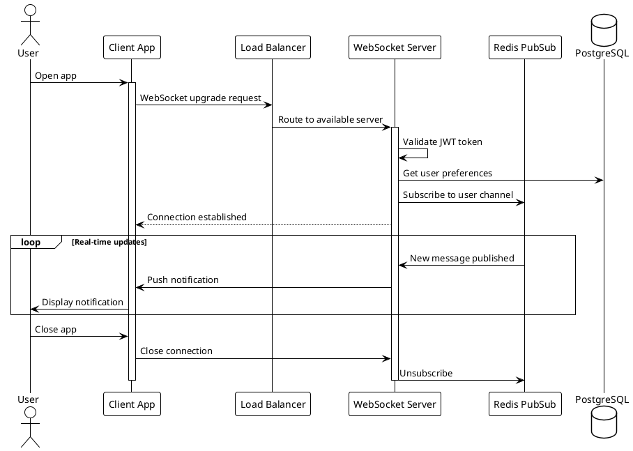

# Architecture Documentation

## Table of Contents
1. [Architecture Decision Records (ADRs)](#architecture-decision-records-adrs)
2. [C4 Model Documentation](#c4-model-documentation)
3. [System Design Documents](#system-design-documents)
4. [Sequence Diagrams](#sequence-diagrams)
5. [Data Flow Documentation](#data-flow-documentation)
6. [Infrastructure Documentation](#infrastructure-documentation)
7. [Dependency Documentation](#dependency-documentation)

---

## Architecture Decision Records (ADRs)

### ADR Template (MADR Format)
```markdown
# ADR-0001: Use PostgreSQL for Primary Database

## Status

Accepted

## Context

We need to choose a primary database for our e-commerce platform. The system requires:
- ACID compliance for financial transactions
- Complex queries with joins across multiple tables
- Full-text search capabilities
- JSON storage for flexible product attributes
- High availability and proven scalability

Options considered:
1. PostgreSQL
2. MySQL
3. MongoDB
4. CockroachDB

## Decision

We will use PostgreSQL as our primary database.

## Consequences

### Positive
- Mature ecosystem with excellent tooling
- Strong ACID compliance
- Native JSON/JSONB support for flexible schemas
- Full-text search without additional infrastructure
- Excellent performance for read-heavy workloads
- Wide hosting options (AWS RDS, Cloud SQL, etc.)

### Negative
- Horizontal scaling requires additional tooling (Citus, read replicas)
- Learning curve for team members familiar only with MySQL
- Connection pooling (PgBouncer) needed at scale

### Neutral
- Need to establish backup and recovery procedures
- Will use Prisma as ORM for type safety

## Links

- [PostgreSQL vs MySQL Comparison](internal-wiki-link)
- [Database Scaling Strategy](./ADR-0015-database-scaling.md)
```

### ADR Index Template
```markdown
# Architecture Decision Records

This directory contains Architecture Decision Records (ADRs) for the project.

## Index

| ID | Title | Status | Date |
|----|-------|--------|------|
| [ADR-0001](0001-use-postgresql.md) | Use PostgreSQL for Primary Database | Accepted | 2025-01-15 |
| [ADR-0002](0002-use-nextjs.md) | Use Next.js for Frontend | Accepted | 2025-01-16 |
| [ADR-0003](0003-authentication-strategy.md) | JWT-based Authentication | Accepted | 2025-01-17 |
| [ADR-0004](0004-api-versioning.md) | URL-based API Versioning | Accepted | 2025-01-18 |
| [ADR-0005](0005-message-queue.md) | Use Redis for Message Queue | Proposed | 2025-01-20 |

## Statuses

- **Proposed**: Under discussion
- **Accepted**: Approved and in effect
- **Deprecated**: No longer recommended
- **Superseded**: Replaced by another ADR

## Creating New ADRs

1. Copy the template from `_template.md`
2. Use the next available number
3. Submit as PR for team review
```

### Lightweight ADR (Y-Statement)
```markdown
# ADR-0002: Use Next.js for Frontend

**In the context of** building a modern e-commerce frontend,
**facing** the need for SEO, performance, and developer experience,
**we decided** to use Next.js with App Router,
**and against** Create React App, Remix, and Astro,
**to achieve** server-side rendering, excellent DX, and Vercel deployment,
**accepting** vendor lock-in risk and larger bundle sizes for simple pages.
```

---

## C4 Model Documentation

### Level 1: System Context
```markdown
# System Context Diagram

## Overview

Shows how the e-commerce system fits into the world around it.

```
┌─────────────────────────────────────────────────────────────────────┐
│                                                                     │
│                            ┌──────────┐                             │
│                            │ Customer │                             │
│                            │ [Person] │                             │
│                            └────┬─────┘                             │
│                                 │                                   │
│                    Browses products, places orders                  │
│                                 │                                   │
│                                 ▼                                   │
│  ┌──────────┐         ┌─────────────────┐         ┌──────────┐     │
│  │ Payment  │◄────────│   E-Commerce    │────────►│  Email   │     │
│  │ Provider │ Process │     System      │ Send    │ Service  │     │
│  │[External]│ payment │   [Software]    │ emails  │[External]│     │
│  └──────────┘         └────────┬────────┘         └──────────┘     │
│                                │                                    │
│                     Store/retrieve inventory                        │
│                                │                                    │
│                                ▼                                    │
│                        ┌──────────────┐                            │
│                        │  Warehouse   │                            │
│                        │   System     │                            │
│                        │  [External]  │                            │
│                        └──────────────┘                            │
│                                                                     │
└─────────────────────────────────────────────────────────────────────┘
```

## Actors

| Actor | Description |
|-------|-------------|
| Customer | End user who browses and purchases products |
| Admin | Internal staff managing products and orders |

## External Systems

| System | Description | Integration |
|--------|-------------|-------------|
| Payment Provider | Stripe for payment processing | REST API |
| Email Service | SendGrid for transactional emails | REST API |
| Warehouse System | Third-party inventory management | Webhook + API |
```

### Level 2: Container Diagram
```markdown
# Container Diagram

## Overview

Shows the high-level technical building blocks of the system.

```
┌─────────────────────────────────────────────────────────────────────────┐
│                          E-Commerce System                              │
│                                                                         │
│  ┌─────────────────┐    ┌─────────────────┐    ┌─────────────────┐    │
│  │   Web App       │    │   Mobile App    │    │   Admin Portal  │    │
│  │   [Next.js]     │    │   [React Native]│    │   [React]       │    │
│  │                 │    │                 │    │                 │    │
│  │   Delivers the  │    │   Native mobile │    │   Admin         │    │
│  │   SPA to users  │    │   experience    │    │   dashboard     │    │
│  └────────┬────────┘    └────────┬────────┘    └────────┬────────┘    │
│           │                      │                      │              │
│           └──────────────────────┼──────────────────────┘              │
│                                  │                                      │
│                                  ▼ HTTPS/JSON                           │
│                     ┌────────────────────────┐                         │
│                     │       API Gateway      │                         │
│                     │       [Kong/AWS]       │                         │
│                     │                        │                         │
│                     │   Rate limiting,       │                         │
│                     │   authentication       │                         │
│                     └───────────┬────────────┘                         │
│                                 │                                       │
│           ┌─────────────────────┼─────────────────────┐                │
│           │                     │                     │                │
│           ▼                     ▼                     ▼                │
│  ┌─────────────────┐  ┌─────────────────┐  ┌─────────────────┐        │
│  │  Product API    │  │   Order API     │  │   User API      │        │
│  │  [Node.js]      │  │   [Node.js]     │  │   [Node.js]     │        │
│  │                 │  │                 │  │                 │        │
│  │  Product CRUD,  │  │  Order mgmt,    │  │  Auth, profile  │        │
│  │  search, catalog│  │  checkout flow  │  │  management     │        │
│  └────────┬────────┘  └────────┬────────┘  └────────┬────────┘        │
│           │                    │                    │                  │
│           └────────────────────┼────────────────────┘                  │
│                                │                                       │
│           ┌────────────────────┼────────────────────┐                  │
│           │                    │                    │                  │
│           ▼                    ▼                    ▼                  │
│  ┌─────────────────┐  ┌─────────────────┐  ┌─────────────────┐        │
│  │   PostgreSQL    │  │     Redis       │  │  Elasticsearch  │        │
│  │   [Database]    │  │   [Cache/MQ]    │  │   [Search]      │        │
│  └─────────────────┘  └─────────────────┘  └─────────────────┘        │
│                                                                         │
└─────────────────────────────────────────────────────────────────────────┘
```

## Containers

| Container | Technology | Purpose |
|-----------|------------|---------|
| Web App | Next.js 14 | Server-rendered e-commerce storefront |
| Mobile App | React Native | iOS/Android shopping app |
| Admin Portal | React + Vite | Internal admin dashboard |
| API Gateway | Kong | Rate limiting, auth, routing |
| Product API | Node.js/Express | Product catalog management |
| Order API | Node.js/Express | Order processing and checkout |
| User API | Node.js/Express | Authentication and user management |
| PostgreSQL | v16 | Primary data store |
| Redis | v7 | Caching and session storage |
| Elasticsearch | v8 | Product search and filtering |
```

### Level 3: Component Diagram
```markdown
# Component Diagram - Order API

## Overview

Shows the internal components of the Order API container.

```
┌─────────────────────────────────────────────────────────────────────┐
│                          Order API [Node.js]                        │
│                                                                     │
│  ┌─────────────────────────────────────────────────────────────┐   │
│  │                      API Layer                               │   │
│  │  ┌─────────────┐ ┌─────────────┐ ┌─────────────┐            │   │
│  │  │ Orders      │ │ Cart        │ │ Checkout    │            │   │
│  │  │ Controller  │ │ Controller  │ │ Controller  │            │   │
│  │  └──────┬──────┘ └──────┬──────┘ └──────┬──────┘            │   │
│  └─────────┼───────────────┼───────────────┼────────────────────┘   │
│            │               │               │                        │
│  ┌─────────┼───────────────┼───────────────┼────────────────────┐   │
│  │         ▼               ▼               ▼    Service Layer   │   │
│  │  ┌─────────────┐ ┌─────────────┐ ┌─────────────┐            │   │
│  │  │ Order       │ │ Cart        │ │ Payment     │            │   │
│  │  │ Service     │ │ Service     │ │ Service     │            │   │
│  │  └──────┬──────┘ └──────┬──────┘ └──────┬──────┘            │   │
│  │         │               │               │                    │   │
│  │         │    ┌──────────┴──────────┐    │                    │   │
│  │         │    │                     │    │                    │   │
│  │         ▼    ▼                     ▼    ▼                    │   │
│  │  ┌─────────────┐           ┌─────────────┐                  │   │
│  │  │ Inventory   │           │ Notification│                  │   │
│  │  │ Service     │           │ Service     │                  │   │
│  │  └─────────────┘           └─────────────┘                  │   │
│  └──────────────────────────────────────────────────────────────┘   │
│                                                                     │
│  ┌──────────────────────────────────────────────────────────────┐   │
│  │                    Data Access Layer                         │   │
│  │  ┌─────────────┐ ┌─────────────┐ ┌─────────────┐            │   │
│  │  │ Order       │ │ Cart        │ │ Product     │            │   │
│  │  │ Repository  │ │ Repository  │ │ Repository  │            │   │
│  │  └─────────────┘ └─────────────┘ └─────────────┘            │   │
│  └──────────────────────────────────────────────────────────────┘   │
│                                                                     │
└─────────────────────────────────────────────────────────────────────┘
```

## Components

| Component | Responsibility |
|-----------|----------------|
| OrderController | HTTP endpoints for order operations |
| CartController | HTTP endpoints for cart management |
| CheckoutController | HTTP endpoints for checkout flow |
| OrderService | Order business logic and validation |
| CartService | Cart operations and calculations |
| PaymentService | Payment processing integration |
| InventoryService | Stock management and reservation |
| NotificationService | Email/SMS notification dispatch |
```

---

## System Design Documents

### Design Document Template
```markdown
# Design Document: [Feature Name]

**Author:** [Name]
**Reviewers:** [Names]
**Status:** Draft | In Review | Approved | Implemented
**Last Updated:** 2025-01-20

## 1. Overview

### 1.1 Problem Statement
[What problem are we solving? Why is it important?]

### 1.2 Goals
- Goal 1
- Goal 2

### 1.3 Non-Goals
- Explicitly out of scope item 1
- Explicitly out of scope item 2

## 2. Background

### 2.1 Current State
[How does the system work today?]

### 2.2 Motivation
[Why do we need to change?]

## 3. Proposed Solution

### 3.1 High-Level Design

```
[Architecture diagram]
```

### 3.2 Detailed Design

#### 3.2.1 Component A
[Detailed description]

#### 3.2.2 Component B
[Detailed description]

### 3.3 API Design

```typescript
// New/modified endpoints
POST /api/v1/feature
{
  "field": "value"
}
```

### 3.4 Data Model Changes

```sql
-- New tables or schema changes
CREATE TABLE new_table (
    id UUID PRIMARY KEY,
    ...
);
```

## 4. Alternatives Considered

### 4.1 Alternative A
**Description:** [Approach description]
**Pros:** [Benefits]
**Cons:** [Drawbacks]
**Why not chosen:** [Reasoning]

### 4.2 Alternative B
[Same structure]

## 5. Implementation Plan

### 5.1 Phases
1. Phase 1: [Description]
2. Phase 2: [Description]

### 5.2 Rollout Strategy
- [ ] Feature flag implementation
- [ ] Gradual rollout percentages
- [ ] Rollback plan

## 6. Operational Considerations

### 6.1 Monitoring
- New metrics to track
- Alert thresholds

### 6.2 Security
- Authentication/authorization changes
- Data privacy considerations

### 6.3 Performance
- Expected load
- Scaling considerations

## 7. Testing Strategy

### 7.1 Unit Tests
[Coverage requirements]

### 7.2 Integration Tests
[Test scenarios]

### 7.3 Load Tests
[Performance requirements]

## 8. Open Questions

- [ ] Question 1
- [ ] Question 2

## 9. References

- [Link to related documents]
- [Link to research]
```

---

## Sequence Diagrams

### Mermaid Sequence Diagram
```markdown
## User Authentication Flow



## Order Checkout Flow


```

### PlantUML Sequence Diagram
```markdown
## WebSocket Connection Flow


```

---

## Data Flow Documentation

### Data Flow Diagram
```markdown
# Data Flow: Order Processing

## Overview

Documents how order data flows through the system from creation to fulfillment.

## Flow Diagram

```
┌──────────────────────────────────────────────────────────────────────────┐
│                          ORDER DATA FLOW                                  │
├──────────────────────────────────────────────────────────────────────────┤
│                                                                          │
│   ┌─────────┐     ┌─────────┐     ┌─────────┐     ┌─────────┐          │
│   │ Customer│────▶│  Cart   │────▶│Checkout │────▶│  Order  │          │
│   │ Browser │     │ Service │     │ Service │     │ Created │          │
│   └─────────┘     └─────────┘     └─────────┘     └────┬────┘          │
│                                                        │                │
│                         ┌──────────────────────────────┘                │
│                         │                                               │
│         ┌───────────────┼───────────────┐                               │
│         │               │               │                               │
│         ▼               ▼               ▼                               │
│   ┌─────────┐     ┌─────────┐     ┌─────────┐                          │
│   │ Payment │     │Inventory│     │  Email  │                          │
│   │ Process │     │ Reserve │     │  Send   │                          │
│   └────┬────┘     └────┬────┘     └─────────┘                          │
│        │               │                                                │
│        └───────┬───────┘                                                │
│                │                                                        │
│                ▼                                                        │
│         ┌─────────┐     ┌─────────┐     ┌─────────┐                    │
│         │  Order  │────▶│Warehouse│────▶│ Shipped │                    │
│         │Confirmed│     │ Notify  │     │         │                    │
│         └─────────┘     └─────────┘     └────┬────┘                    │
│                                              │                         │
│                                              ▼                         │
│                                        ┌─────────┐                     │
│                                        │Delivered│                     │
│                                        └─────────┘                     │
│                                                                        │
└────────────────────────────────────────────────────────────────────────┘
```

## Data Transformations

| Stage | Input | Output | Transformation |
|-------|-------|--------|----------------|
| Cart → Checkout | Cart items | Order draft | Add shipping, calculate totals |
| Checkout → Order | Order draft + payment | Order record | Confirm payment, generate ID |
| Order → Warehouse | Order record | Fulfillment request | Extract shipping details |
| Warehouse → Shipped | Fulfillment | Tracking info | Add carrier, tracking number |

## Data Retention

| Data Type | Retention Period | Storage |
|-----------|-----------------|---------|
| Cart data | 30 days | Redis |
| Order records | 7 years | PostgreSQL |
| Payment data | 7 years | Stripe (reference only) |
| Shipping tracking | 1 year | PostgreSQL |
```

---

## Infrastructure Documentation

### Infrastructure Overview
```markdown
# Infrastructure Documentation

## Architecture Diagram

```
┌─────────────────────────────────────────────────────────────────────────┐
│                              AWS Cloud                                   │
│                                                                         │
│  ┌────────────────────────────────────────────────────────────────┐    │
│  │                           VPC                                   │    │
│  │                                                                 │    │
│  │  ┌─────────────────────┐    ┌─────────────────────┐           │    │
│  │  │   Public Subnet     │    │   Public Subnet     │           │    │
│  │  │      (AZ-A)         │    │      (AZ-B)         │           │    │
│  │  │                     │    │                     │           │    │
│  │  │  ┌─────────────┐   │    │  ┌─────────────┐   │           │    │
│  │  │  │     ALB     │   │    │  │     ALB     │   │           │    │
│  │  │  └──────┬──────┘   │    │  └──────┬──────┘   │           │    │
│  │  └─────────┼──────────┘    └─────────┼──────────┘           │    │
│  │            │                         │                       │    │
│  │  ┌─────────┼─────────────────────────┼──────────────────┐   │    │
│  │  │         ▼         Private Subnet  ▼                  │   │    │
│  │  │  ┌─────────────┐           ┌─────────────┐          │   │    │
│  │  │  │  ECS Task   │           │  ECS Task   │          │   │    │
│  │  │  │  (API)      │           │  (API)      │          │   │    │
│  │  │  └─────────────┘           └─────────────┘          │   │    │
│  │  │                                                      │   │    │
│  │  │  ┌─────────────┐           ┌─────────────┐          │   │    │
│  │  │  │  ECS Task   │           │  ECS Task   │          │   │    │
│  │  │  │  (Worker)   │           │  (Worker)   │          │   │    │
│  │  │  └─────────────┘           └─────────────┘          │   │    │
│  │  └──────────────────────────────────────────────────────┘   │    │
│  │                                                             │    │
│  │  ┌─────────────────────────────────────────────────────┐   │    │
│  │  │                  Data Subnet                        │   │    │
│  │  │                                                     │   │    │
│  │  │  ┌─────────────┐  ┌─────────────┐  ┌────────────┐  │   │    │
│  │  │  │    RDS      │  │ ElastiCache │  │   S3       │  │   │    │
│  │  │  │ (Primary)   │  │  (Redis)    │  │  Bucket    │  │   │    │
│  │  │  └─────────────┘  └─────────────┘  └────────────┘  │   │    │
│  │  │                                                     │   │    │
│  │  │  ┌─────────────┐                                   │   │    │
│  │  │  │    RDS      │                                   │   │    │
│  │  │  │  (Replica)  │                                   │   │    │
│  │  │  └─────────────┘                                   │   │    │
│  │  └─────────────────────────────────────────────────────┘   │    │
│  │                                                             │    │
│  └─────────────────────────────────────────────────────────────┘    │
│                                                                      │
│  External Services:                                                  │
│  ┌──────────┐ ┌──────────┐ ┌──────────┐ ┌──────────┐              │
│  │CloudFront│ │ Route53  │ │   SES    │ │CloudWatch│              │
│  └──────────┘ └──────────┘ └──────────┘ └──────────┘              │
│                                                                      │
└──────────────────────────────────────────────────────────────────────┘
```

## Resource Inventory

| Resource | Type | Specs | Purpose |
|----------|------|-------|---------|
| ALB | Application Load Balancer | 2 AZs | Traffic distribution |
| ECS Cluster | Fargate | - | Container orchestration |
| API Service | ECS Service | 2-10 tasks, 512 CPU, 1GB RAM | API containers |
| Worker Service | ECS Service | 2-5 tasks, 256 CPU, 512MB RAM | Background jobs |
| RDS Primary | PostgreSQL 16 | db.r6g.xlarge, 500GB | Primary database |
| RDS Replica | PostgreSQL 16 | db.r6g.large, 500GB | Read replica |
| ElastiCache | Redis 7 | cache.r6g.large, cluster mode | Caching, sessions |
| S3 | Standard | - | Static assets, uploads |

## Network Configuration

| CIDR | Subnet | Purpose |
|------|--------|---------|
| 10.0.0.0/16 | VPC | Main VPC |
| 10.0.1.0/24 | Public A | ALB, NAT Gateway |
| 10.0.2.0/24 | Public B | ALB, NAT Gateway |
| 10.0.10.0/24 | Private A | ECS Tasks |
| 10.0.11.0/24 | Private B | ECS Tasks |
| 10.0.20.0/24 | Data A | RDS, ElastiCache |
| 10.0.21.0/24 | Data B | RDS, ElastiCache |

## Security Groups

| Name | Inbound | Outbound | Attached To |
|------|---------|----------|-------------|
| alb-sg | 443 from 0.0.0.0/0 | All to vpc | ALB |
| ecs-sg | 3000 from alb-sg | All | ECS Tasks |
| rds-sg | 5432 from ecs-sg | None | RDS |
| redis-sg | 6379 from ecs-sg | None | ElastiCache |
```

---

## Dependency Documentation

### Dependency Map
```markdown
# Service Dependencies

## Dependency Diagram

```
┌─────────────────────────────────────────────────────────────────────┐
│                      SERVICE DEPENDENCIES                            │
├─────────────────────────────────────────────────────────────────────┤
│                                                                     │
│                        ┌──────────────┐                             │
│                        │   Frontend   │                             │
│                        │   (Next.js)  │                             │
│                        └──────┬───────┘                             │
│                               │                                     │
│                               ▼                                     │
│                        ┌──────────────┐                             │
│                        │ API Gateway  │                             │
│                        └──────┬───────┘                             │
│                               │                                     │
│         ┌─────────────────────┼─────────────────────┐              │
│         │                     │                     │              │
│         ▼                     ▼                     ▼              │
│  ┌─────────────┐      ┌─────────────┐      ┌─────────────┐        │
│  │ Product API │      │  Order API  │      │  User API   │        │
│  └──────┬──────┘      └──────┬──────┘      └──────┬──────┘        │
│         │                    │                    │                │
│         │    ┌───────────────┼───────────────┐   │                │
│         │    │               │               │   │                │
│         ▼    ▼               ▼               ▼   ▼                │
│  ┌─────────────┐      ┌─────────────┐      ┌─────────────┐        │
│  │ PostgreSQL  │      │    Redis    │      │Elasticsearch│        │
│  │  (primary)  │◄─────│   (cache)   │      │  (search)   │        │
│  └─────────────┘      └─────────────┘      └─────────────┘        │
│                                                                    │
│  External Dependencies:                                            │
│  ┌─────────────┐ ┌─────────────┐ ┌─────────────┐                 │
│  │   Stripe    │ │  SendGrid   │ │   Twilio    │                 │
│  │ (payments)  │ │  (email)    │ │   (sms)     │                 │
│  └─────────────┘ └─────────────┘ └─────────────┘                 │
│                                                                    │
└────────────────────────────────────────────────────────────────────┘
```

## Dependency Matrix

| Service | Depends On | Depended By | Criticality |
|---------|------------|-------------|-------------|
| Frontend | API Gateway | - | High |
| API Gateway | All APIs | Frontend | Critical |
| Product API | PostgreSQL, Elasticsearch, Redis | API Gateway | High |
| Order API | PostgreSQL, Redis, Stripe, SendGrid | API Gateway | Critical |
| User API | PostgreSQL, Redis, SendGrid | API Gateway | Critical |
| PostgreSQL | - | All APIs | Critical |
| Redis | - | All APIs | High |
| Elasticsearch | - | Product API | Medium |

## Failure Modes

| Dependency Failure | Impact | Mitigation |
|-------------------|--------|------------|
| PostgreSQL down | Full outage | Multi-AZ, automatic failover |
| Redis down | Degraded performance | Fallback to DB, circuit breaker |
| Elasticsearch down | Search unavailable | Fallback to DB search |
| Stripe down | Checkout unavailable | Queue orders, retry |
| SendGrid down | Emails delayed | Queue emails, retry |
```
